# Git-Clone-With-DSA - Mermaid.js Diagrams

This file contains all the Mermaid.js diagram code for the project documentation.

---

## Table of Contents
1. [Architecture Diagram](#1-architecture-diagram)
2. [Flow Chart](#2-flow-chart)
3. [Data Structure Diagrams](#3-data-structure-diagrams)
   - [Linked List (Commits)](#31-linked-list-commits)
   - [Hash Table (Staging Area)](#32-hash-table-staging-area)
   - [Stack (Stash)](#33-stack-stash)
   - [Tree (Branches)](#34-tree-branches)
4. [Git Graph](#4-git-graph)
5. [Class Diagram](#5-class-diagram)
6. [Sequence Diagrams](#6-sequence-diagrams)

---

## 1. Architecture Diagram

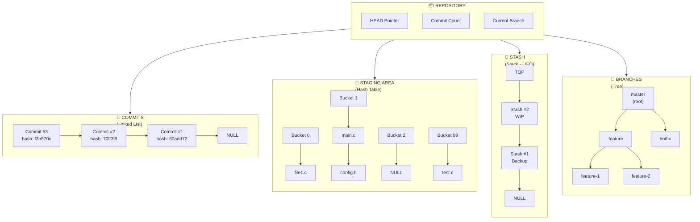

---

## 2. Flow Chart

### 2.1 Main Command Processing Flow

```mermaid
flowchart TD
    START([🚀 START]) --> PARSE[Parse Command]
    
    PARSE --> |init| INIT
    PARSE --> |add| ADD
    PARSE --> |commit| COMMIT
    PARSE --> |log| LOG
    PARSE --> |status| STATUS
    PARSE --> |stash| STASH
    PARSE --> |branch| BRANCH
    PARSE --> |graph| GRAPH
    PARSE --> |exit| EXIT
    
    subgraph INIT[" INIT "]
        I1[Allocate Repository] --> I2[Initialize Hash Table]
        I2 --> I3[Initialize Stash Stack]
        I3 --> I4[Create master branch]
    end
    
    subgraph ADD[" ADD "]
        A1[Hash filename] --> A2{File exists?}
        A2 --> |Yes| A3[Update hash]
        A2 --> |No| A4[Create FileEntry]
        A4 --> A5[Insert at bucket head]
    end
    
    subgraph COMMIT[" COMMIT "]
        CM1{Staging empty?} --> |Yes| CM2[Error: Nothing to commit]
        CM1 --> |No| CM3[Create CommitNode]
        CM3 --> CM4[Generate hash]
        CM4 --> CM5[Link to HEAD]
        CM5 --> CM6[Update branch HEAD]
        CM6 --> CM7[Clear staging]
    end
    
    subgraph LOG[" LOG "]
        L1[Start at HEAD] --> L2{Current != NULL?}
        L2 --> |Yes| L3[Print commit info]
        L3 --> L4[Move to next]
        L4 --> L2
        L2 --> |No| L5[Print Initial State]
    end
    
    subgraph STATUS[" STATUS "]
        ST1[Iterate Hash Table] --> ST2{Bucket empty?}
        ST2 --> |No| ST3[Print files in bucket]
        ST3 --> ST4[Next bucket]
        ST4 --> ST2
        ST2 --> |Yes| ST4
    end
    
    subgraph STASH[" STASH "]
        STH1{Subcommand?}
        STH1 --> |save| STH2[Push to stack]
        STH1 --> |pop| STH3[Pop from stack]
        STH1 --> |list| STH4[Traverse stack]
    end
    
    subgraph BRANCH[" BRANCH "]
        BR1{Subcommand?}
        BR1 --> |create| BR2[Add child node]
        BR1 --> |checkout| BR3[Search & switch]
        BR1 --> |list| BR4[DFS traversal]
        BR1 --> |delete| BR5[Remove node]
    end
    
    subgraph GRAPH[" GRAPH "]
        G1[Collect all commits] --> G2[Sort by ID]
        G2 --> G3[Display visual tree]
    end
    
    INIT --> DONE
    ADD --> DONE
    COMMIT --> DONE
    LOG --> DONE
    STATUS --> DONE
    STASH --> DONE
    BRANCH --> DONE
    GRAPH --> DONE
    
    DONE([ Done]) --> PARSE
    EXIT([ EXIT])
```

### 2.2 Simplified Flow

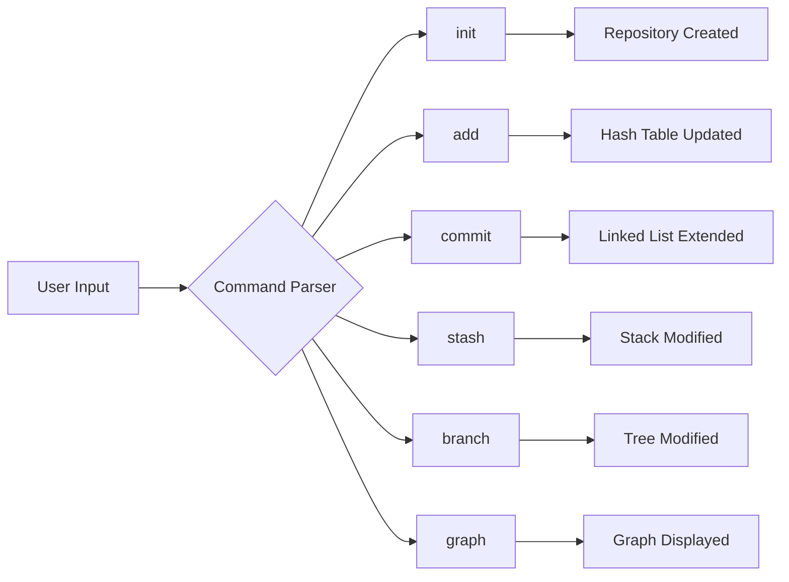

---

## 3. Data Structure Diagrams

### 3.1 Linked List (Commits)

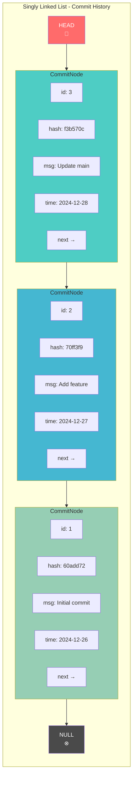

### 3.2 Hash Table (Staging Area)

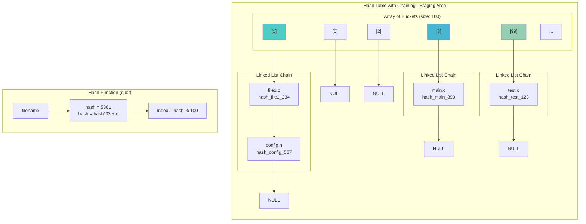

### 3.3 Stack (Stash)

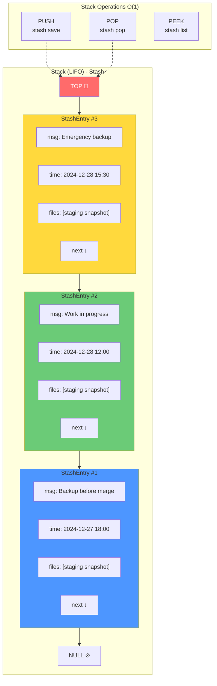

### 3.4 Tree (Branches)

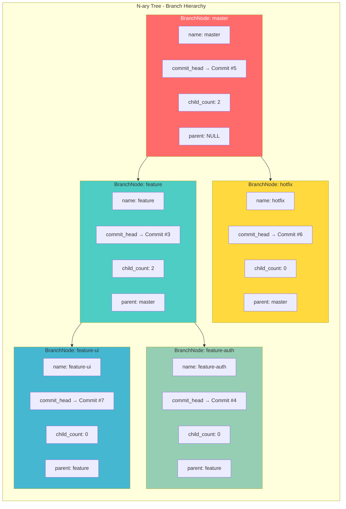

---

## 4. Git Graph

### 4.1 Simple Git Graph

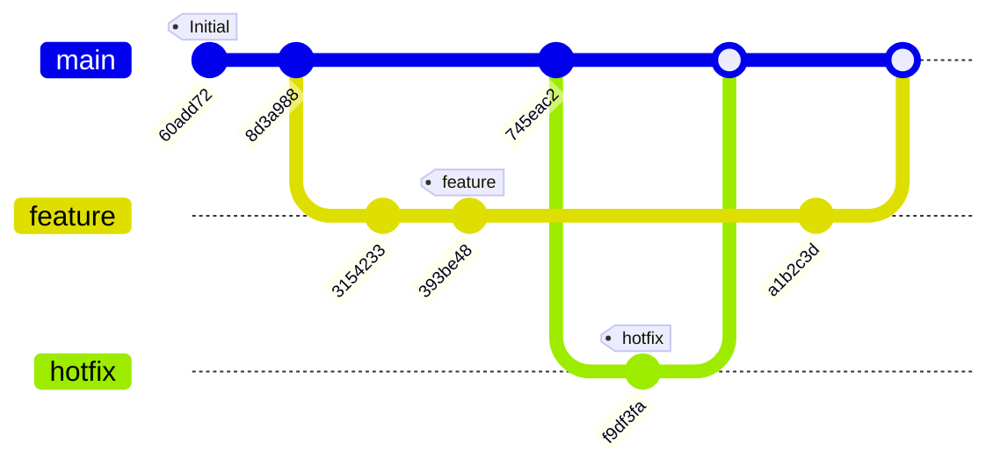

### 4.2 Complex Git Graph with Multiple Branches

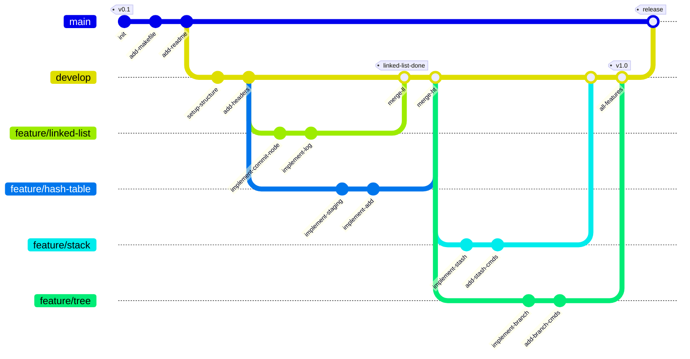

### 4.3 Git Graph showing Our Project's Development

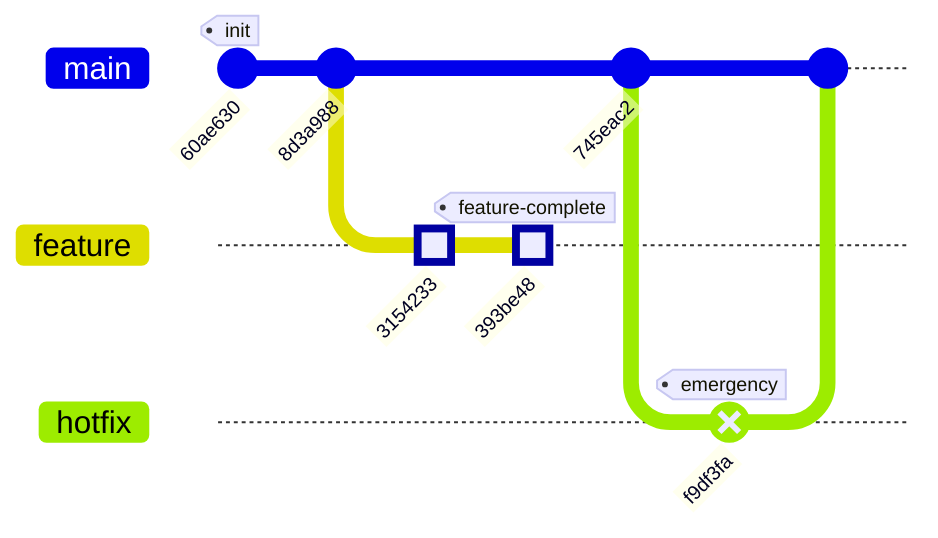

---

## 5. Class Diagram

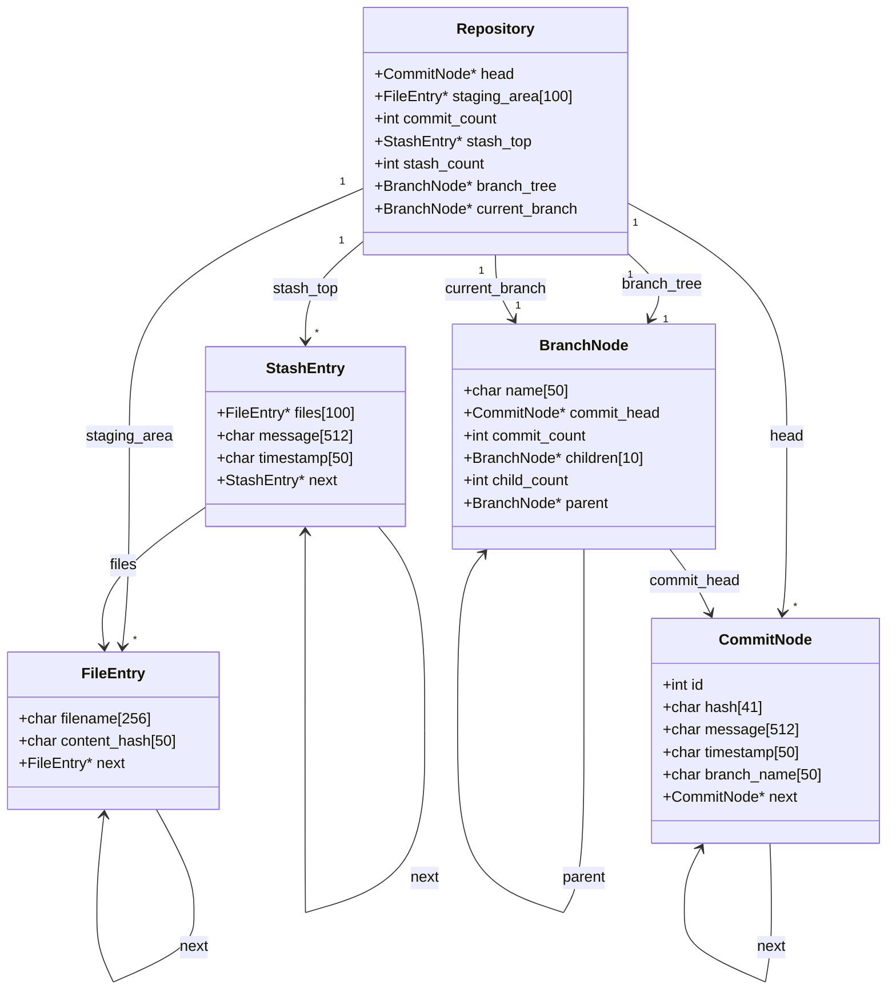

---

## 6. Sequence Diagrams

### 6.1 Commit Workflow

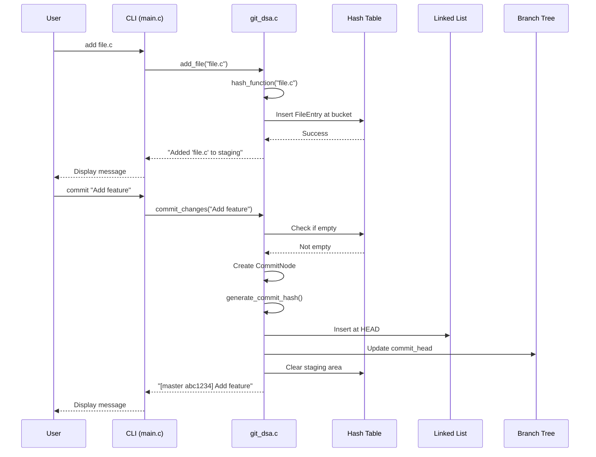

### 6.2 Branch Workflow

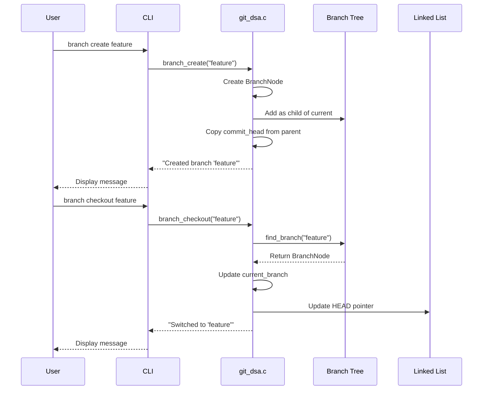

### 6.3 Stash Workflow

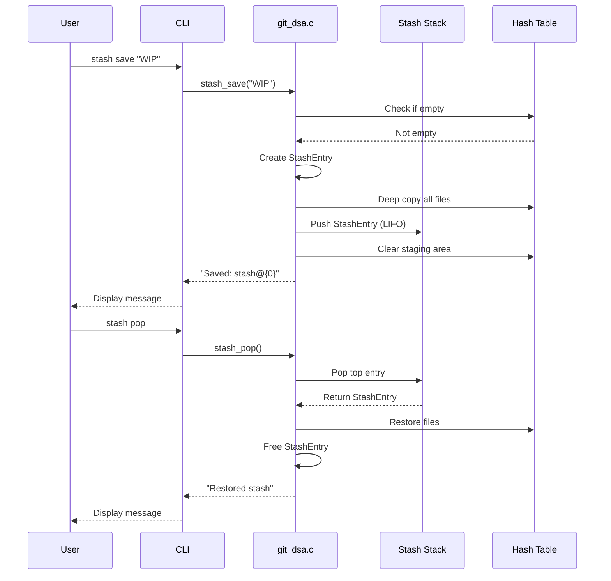

---

## 7. State Diagram

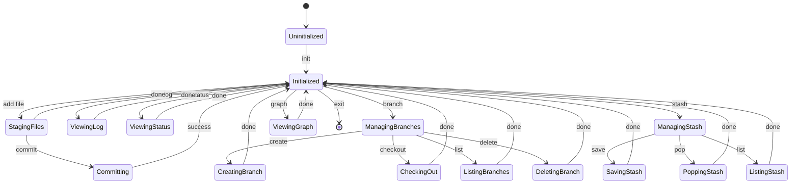

---

## 8. Data Flow Diagram

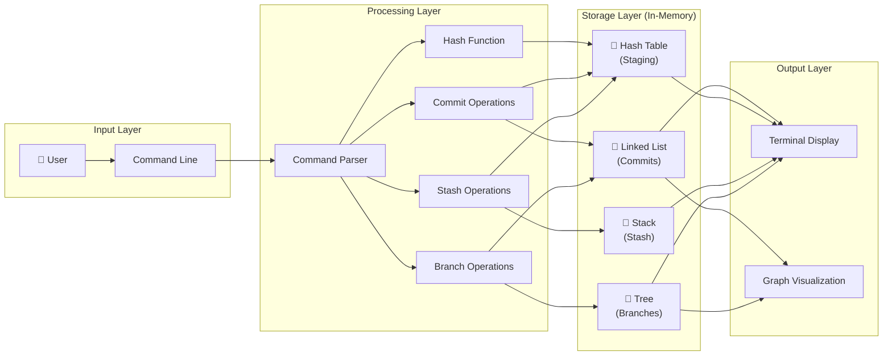

---

## 9. Time Complexity Visualization

```mermaid
xychart-beta
    title "Time Complexity Comparison"
    x-axis ["Insert", "Search", "Delete", "Traverse"]
    y-axis "Operations" 0 --> 5
    bar [1, 1, 1, 4] "Hash Table O(1)/O(n)"
    bar [1, 4, 1, 4] "Linked List"
    bar [1, 1, 1, 4] "Stack"
    bar [4, 4, 4, 4] "Tree (worst)"
```

---

## How to Use These Diagrams

### In GitHub README
GitHub natively supports Mermaid diagrams. Simply include the code blocks with ` ```mermaid ` in your README.md file.

### In Documentation Sites
Most modern documentation generators (Docusaurus, MkDocs, GitBook) support Mermaid.

### Export as Images
Use tools like:
- [Mermaid Live Editor](https://mermaid.live/)
- VS Code extensions (Markdown Preview Mermaid Support)
- CLI tool: `mmdc` (mermaid-cli)

```bash
# Install mermaid-cli
npm install -g @mermaid-js/mermaid-cli

# Convert to PNG
mmdc -i diagrams.md -o output.png
```

---

## References

- [Mermaid.js Documentation](https://mermaid.js.org/)
- [Git Graph Syntax](https://mermaid.js.org/syntax/gitgraph.html)
- [Flowchart Syntax](https://mermaid.js.org/syntax/flowchart.html)
- [Class Diagram Syntax](https://mermaid.js.org/syntax/classDiagram.html)
- [Sequence Diagram Syntax](https://mermaid.js.org/syntax/sequenceDiagram.html)

---

*Generated for Git-Clone-With-DSA Project - December 2024*
